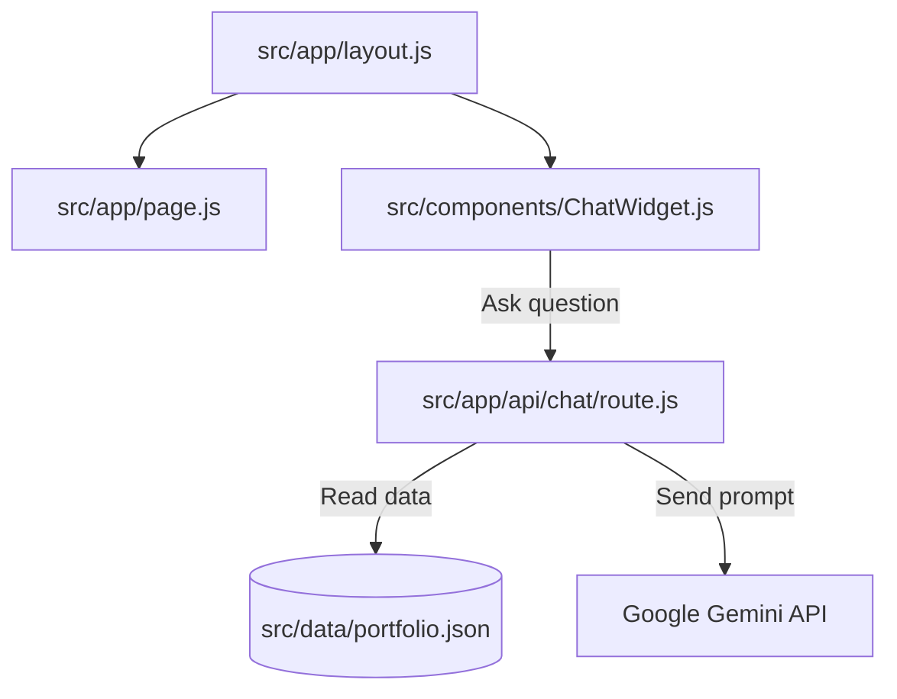

# Anshuman Singh | AI Career Portfolio

This is my personal portfolio website, featuring an AI chat assistant. It displays my education, skills, projects, and clubs, and lets you chat with an AI that knows all about my background.

----

## Tech Stack

Here is what I used to build the website:
* **Framework**: Next.js 16 (using the App Router)
* **Library**: React 19
* **Styling**: Tailwind CSS v4 and custom CSS for styling and animations
* **AI Model**: Google Gemini API (`gemini-2.5-flash-lite` model) to run the chatbot

---

## Architecture

Here is how the project is organized:



* **[portfolio.json](file:///c:/Users/anshu/ai-portfolio-copilot/src/data/portfolio.json)**: The main file that stores all my info (my education, projects, contact details, and skills). Both the website pages and the AI read from this file.
* **[ChatWidget.js](file:///c:/Users/anshu/ai-portfolio-copilot/src/components/ChatWidget.js)**: The floating chat window on the bottom right where you can type questions.
* **[route.js](file:///c:/Users/anshu/ai-portfolio-copilot/src/app/api/chat/route.js)**: The backend code that takes your question, loads the portfolio data, and asks the Gemini model for an answer.
* **[src/app/](file:///c:/Users/anshu/ai-portfolio-copilot/src/app)**: The pages of the website (like About, Skills, Projects, Education, and Contact).

---

## AI Design

How the chat assistant works under the hood:

1. **Information Grounding**: Every time you send a message, the backend reads the `portfolio.json` file and hands it to the AI.
2. **Strict Rules**: The AI has instructions to only answer using my actual portfolio data. If you ask it about things not in my portfolio (like unrelated coding questions or random trivia), it will politely say that it cannot answer.
3. **Conversation Memory**: The chat widget remembers previous messages so you can ask follow-up questions.
4. **Focused Settings**: The AI settings are configured so it focuses strictly on facts and keeps answers short and easy to read.

---

## Setup

Follow these steps to run the website on your computer:

### 1. Requirements
Make sure you have [Node.js](https://nodejs.org/) installed.

### 2. Clone and Install
```bash
# Clone the project from GitHub
git clone https://github.com/Anshuman0617/AI_Portfolio.git
cd AI_Portfolio

# Install the packages
npm install
```

### 3. Add the API Key
Create a file named `.env.local` in the main project folder and add your Gemini API key:
```env
GEMINI_API_KEY=your_actual_key_here
```
> [!NOTE]
> You can get a free API key from Google AI Studio.

### 4. Run the Website
```bash
# Start the development server
npm run dev
```
Now, open **[http://localhost:3000](http://localhost:3000)** in your browser to view the site.

### 5. Build for Production
```bash
# Build the production files
npm run build

# Start the production server
npm start
```

---

## Challenges

* **Stopping the AI from making things up**: Standard AI models can sometimes hallucinate details or answers. I fixed this by writing strict rules in the system instructions telling the AI to only use the data inside `portfolio.json`.
* **Styling the chat box**: Making the chat window float correctly, show typing animations, and scroll down automatically when new messages appear took some trial and error.

---

## Future Plans

* **Saving chat history**: Store messages in local storage so your chat history doesn't disappear when you refresh or navigate pages.
* **Interactive buttons in chat**: Let the AI show links, resume download buttons, or preview cards instead of just plain text.
* **Simple analytics**: Keep track of the most common questions people ask the chatbot.
